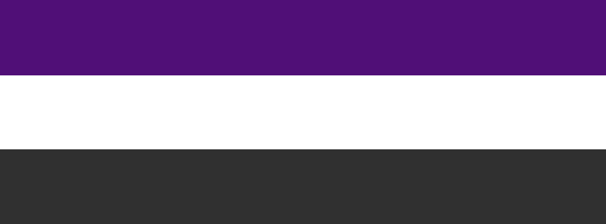

# Yorani 

Yorani is a [conlang](https://en.wikipedia.org/wiki/Constructed_language) created by Lukáš Tomášek. The name of the language is either Yorani (as in Hindi),
or using adjective - Yoran languange.

## Dictionary

Over the times Lukáš created a dictionary containing over 35 000 words. Presently the dictionary only works between Czech and Yoran languanges. This online dictionary works independently on case input and leading or trailing whitespaces. It is **diacritic sensitive**.

## Grammar

Lukáš created basic grammar rules. Yorani is mainly inspired by [Slavic languages](https://en.wikipedia.org/wiki/Slavic_languages). Compared to most natural languages, Yorani is more logical, with fewer exceptions to rules.

## History

Development of Yorani started in 2014, when Lukáš was a  first year student at [Charles University](https://cuni.cz/UKEN-1.html).